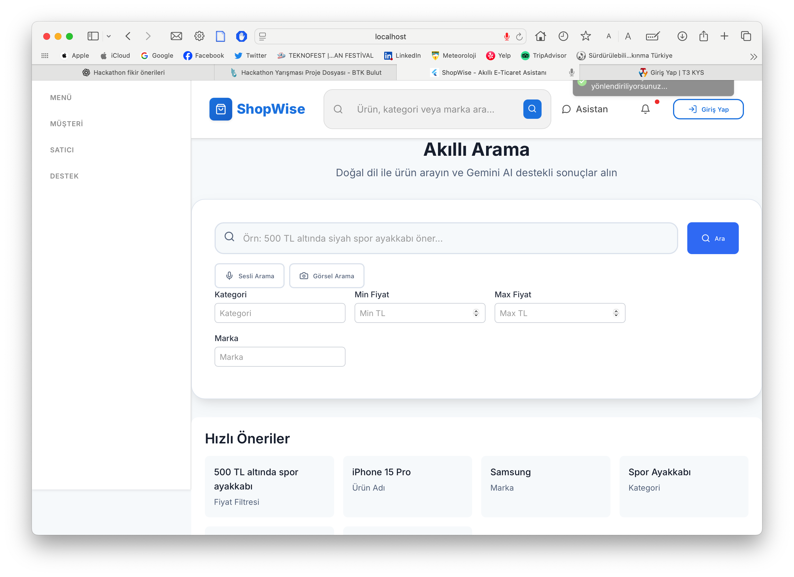
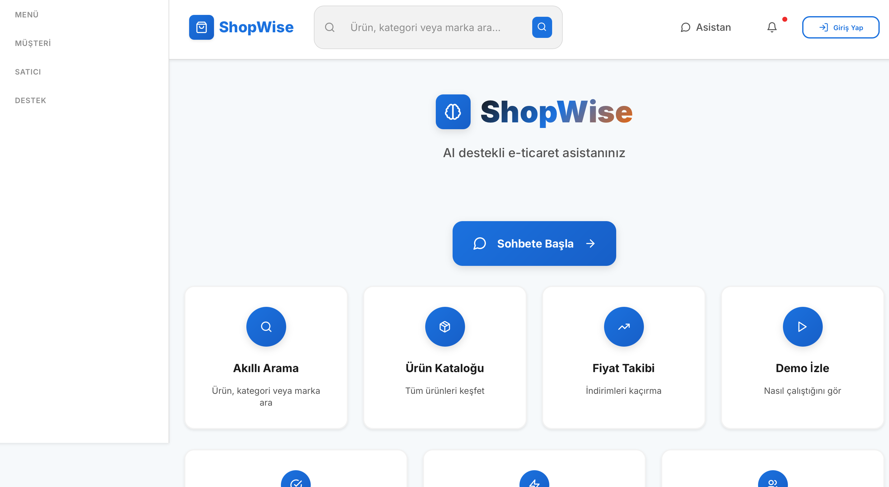
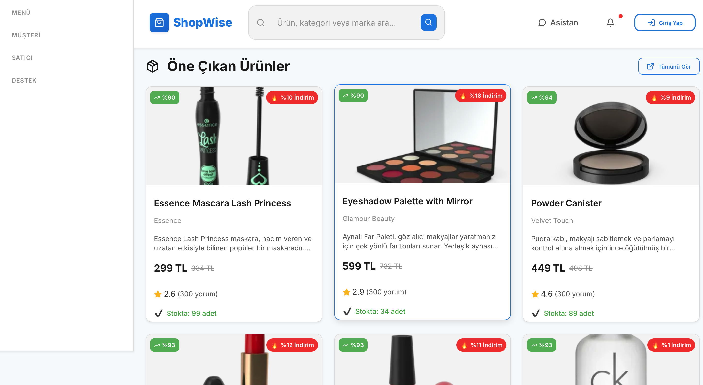
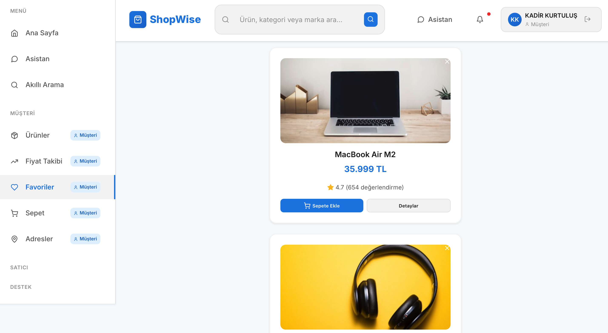
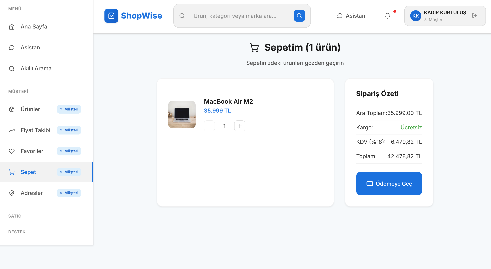
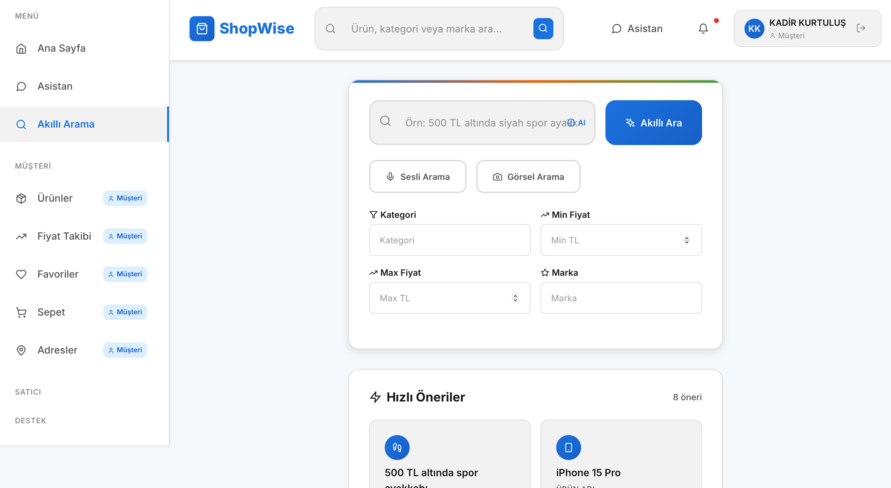
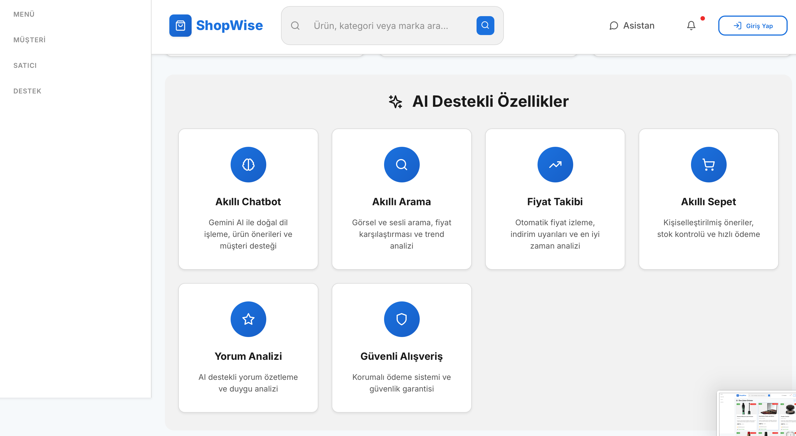
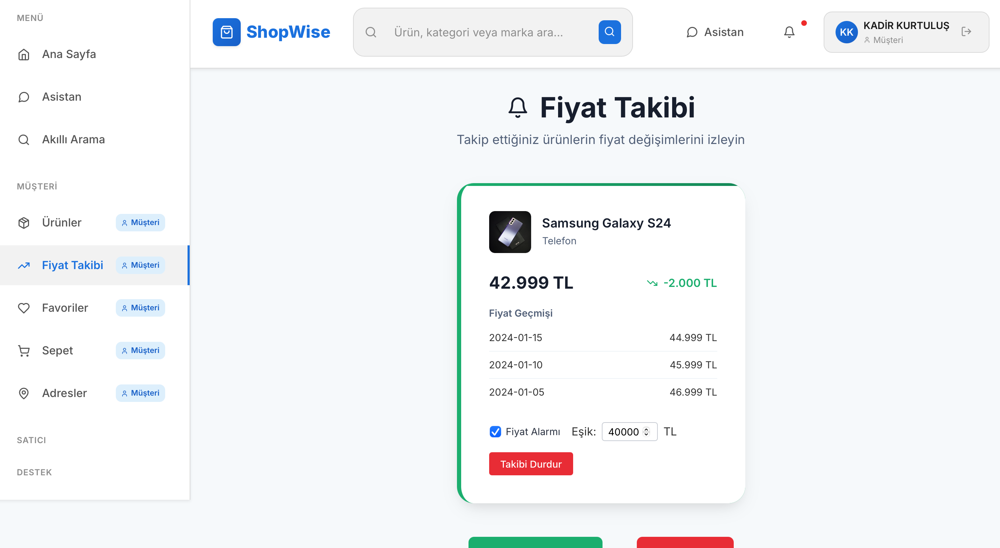
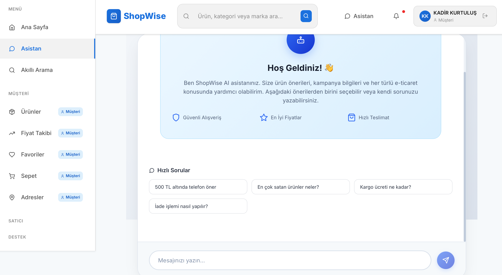

# 🚀 ShopWise - Gemini Destekli Akıllı E-Ticaret Platformu

[](https://github.com/KadirKrtls/ShopWise-Gemini-E-Ticaret-Asistani/actions/workflows/ci.yml)
[](https://opensource.org/licenses/MIT)
[](https://www.python.org/downloads/)
[](https://reactjs.org/)
[](https://github.com/psf/black)
[](SECURITY.md)

ShopWise, müşteriler ve satıcılar için AI destekli akıllı e-ticaret platformudur. Gemini AI teknolojisi ile güçlendirilmiş chatbot, ürün önerileri ve satıcı araçları sunar.

## 📸 Uygulama Ekran Görüntüleri

### 🏠 Ana Sayfa - Modern Dashboard
Modern ve kullanıcı dostu dashboard tasarımı ile hızlı erişim imkanı.



*Ana sayfa özellikler: Quick Actions, gerçek zamanlı metrikler, responsive tasarım*

---

### 🤖 AI Chatbot - Gemini Destekli Asistan
Doğal dil işleme ve akıllı ürün önerileri sunan AI asistanı.



*AI Chatbot özellikleri: Doğal sohbet, ürün önerileri, gerçek zamanlı yanıtlar*

---

### 🔍 Akıllı Arama - Doğal Dil Arama
Doğal dil ile arama yapın, AI analiz sonuçları alın.



*Arama özellikleri: Doğal dil işleme, AI analizi, autocomplete*

---

### 🛍️ Ürün Detayı - Tam Özellikli Sayfa
Detaylı ürün bilgileri, sepete ekleme, favorilere ekleme.



*Ürün detayı özellikleri: Galeri, özellikler, sepete ekleme, favoriler*

---

### 🛒 Alışveriş Sepeti - Tam E-Ticaret Deneyimi
KDV hesaplama, kargo hesaplama, ödeme akışı.



*Sepet özellikleri: KDV hesaplama, kargo ücreti, miktar kontrolü*

---

### ❤️ Favoriler - Kişisel Koleksiyon
Beğendiğiniz ürünleri favorilere ekleyin, kolayca yönetin.



*Favoriler özellikleri: Kolay yönetim, hızlı erişim, sepete ekleme*

---

### 📊 Ürün Karşılaştırma - AI Destekli Analiz
İki ürünü karşılaştırın, AI destekli analiz sonuçları alın.



*Karşılaştırma özellikleri: AI analizi, detaylı karşılaştırma, karar desteği*

---

### 📈 Fiyat Takibi - Gerçek Zamanlı İzleme
Ürün fiyatlarını takip edin, alarm kurun.



*Fiyat takibi özellikleri: Gerçek zamanlı takip, alarm sistemi, fiyat geçmişi*

---

### 🏪 Satıcı Paneli - AI Destekli Araçlar
Satıcılar için AI destekli ürün yönetimi ve analiz araçları.



*Satıcı araçları: AI ürün açıklaması, stok tahmini, satış analizi*

---

## 🏗️ Sistem Mimarisi



```mermaid
graph TB
    subgraph "Frontend"
        A[React App]
        B[Styled Components]
        C[React Query]
    end
    
    subgraph "Backend"
        D[FastAPI]
        E[SQLAlchemy]
        F[JWT Auth]
    end
    
    subgraph "AI Services"
        G[Google Gemini]
        H[Natural Language Processing]
        I[Product Analysis]
    end
    
    subgraph "Database"
        J[SQLite]
        K[User Data]
        L[Product Data]
    end
    
    A --> D
    D --> E
    E --> J
    D --> G
    G --> H
    G --> I
    
    style A fill:#61dafb
    style D fill:#009688
    style G fill:#4285f4
    style J fill:#003b57
```

## ✨ Özellikler

### 👤 Müşteri Özellikleri
- **AI Chatbot**: Gemini destekli akıllı asistan
- **Akıllı Ürün Önerileri**: Kişiselleştirilmiş ürün tavsiyeleri
- **Fiyat Takibi**: Ürün fiyatlarını takip etme
- **Ürün Karşılaştırma**: AI destekli ürün analizi
- **Güvenli Alışveriş**: Korumalı ödeme sistemi

### 🏪 Satıcı Özellikleri
- **AI Ürün Açıklaması**: Otomatik SEO uyumlu açıklama oluşturma
- **Stok Tahmini**: AI destekli stok yönetimi
- **Satış Analizi**: Detaylı raporlama
- **Müşteri İletişimi**: Gelişmiş mesajlaşma sistemi

### 🤖 AI Modülleri
- **Gemini Chatbot**: Doğal dil işleme
- **Ürün Analizi**: Yorum ve değerlendirme analizi
- **Stok Optimizasyonu**: Yapay zeka destekli tahmin
- **SEO Optimizasyonu**: Otomatik içerik iyileştirme

## 🛠️ Teknolojiler

### Backend
- **FastAPI**: Modern Python web framework
- **SQLAlchemy**: ORM ve veritabanı yönetimi
- **Google Gemini AI**: Yapay zeka entegrasyonu
- **JWT Authentication**: Güvenli kimlik doğrulama
- **SQLite**: Geliştirme veritabanı

### Frontend
- **React**: Modern UI framework
- **Styled Components**: CSS-in-JS styling
- **React Router**: Sayfa yönlendirme
- **Axios**: HTTP client
- **React Query**: State management

## 🚀 Kurulum

### Gereksinimler
- Python 3.8+
- Node.js 16+
- Google Gemini API Key

### 1. Repository'yi klonlayın
```bash
git clone <repository-url>
cd Btk_Hackathon_25
```

### 2. Backend Kurulumu
```bash
cd backend

# Virtual environment oluşturun
python -m venv venv
source venv/bin/activate  # Linux/Mac
# venv\Scripts\activate  # Windows

# Bağımlılıkları yükleyin
pip install -r requirements.txt

# Environment değişkenlerini ayarlayın
cp env.example .env
# .env dosyasını düzenleyin ve GEMINI_API_KEY ekleyin

# Database tablolarını oluşturun
python create_tables.py

# Test kullanıcılarını oluşturun
python create_test_user.py

# Backend'i çalıştırın
python run_backend.py
```

### 3. Frontend Kurulumu
```bash
cd frontend

# Bağımlılıkları yükleyin
npm install

# Frontend'i çalıştırın
npm start
```

## 🔑 Test Kullanıcıları

### Müşteri Hesabı
- **Email**: musteri@test.com
- **Şifre**: test123
- **Rol**: customer

### Satıcı Hesabı
- **Email**: satici@test.com
- **Şifre**: test123
- **Rol**: seller

## 📊 API Endpoints

### Authentication
- `POST /api/v1/auth/register` - Kullanıcı kaydı
- `POST /api/v1/auth/login` - Kullanıcı girişi
- `GET /api/v1/auth/me` - Profil bilgisi

### Chatbot
- `POST /api/v1/chatbot/chat` - Genel chatbot
- `POST /api/v1/chatbot/chat/role-based` - Rol bazlı chatbot

### AI Modülleri
- `POST /api/v1/ai/description` - Ürün açıklaması oluşturma
- `POST /api/v1/ai/stock-predict` - Stok tahmini
- `POST /api/v1/ai/analyze-reviews` - Yorum analizi
- `POST /api/v1/ai/correct-address` - Adres düzeltme

### E-commerce
- `GET /api/v1/ecommerce/search` - Ürün arama
- `GET /api/v1/ecommerce/trending` - Trend ürünler
- `GET /api/v1/ecommerce/categories` - Kategoriler

## 🎯 Kullanım Senaryoları

### Müşteri Akışı
1. **Kayıt/Giriş**: customer@test.com ile giriş yapın
2. **Ürün Arama**: Ana sayfada ürünleri keşfedin
3. **AI Chatbot**: Sağ alt köşedeki chatbot ile sorularınızı sorun
4. **Ürün Detayı**: Ürünlere tıklayarak detayları görün
5. **Sepet İşlemleri**: Ürünleri sepete ekleyin ve ödeme yapın

### Satıcı Akışı
1. **Kayıt/Giriş**: seller@test.com ile giriş yapın
2. **Ürün Yönetimi**: Products sayfasında ürünlerinizi yönetin
3. **AI Açıklama**: "AI Ürün Açıklaması Oluştur" butonunu kullanın
4. **Stok Tahmini**: "AI Stok Tahmini" ile stok yönetimi yapın
5. **Satış Analizi**: Dashboard'da satış raporlarını görün

## 🔧 Geliştirme

### Backend Geliştirme
```bash
cd backend
python run_backend.py
```

### Frontend Geliştirme
```bash
cd frontend
npm start
```

### Database Yönetimi
```bash
cd backend
python create_tables.py  # Tabloları oluştur
python create_test_user.py  # Test kullanıcıları oluştur
```

## 📝 Environment Variables

Backend `.env` dosyası:
```env
DATABASE_URL=sqlite:///./shopwise.db
GEMINI_API_KEY=your_gemini_api_key_here
SECRET_KEY=your_secret_key_here
```

## 🧪 Test

### Backend Testleri
```bash
cd backend
pytest
```

### API Dokümantasyonu
- Swagger UI: http://localhost:8000/docs
- ReDoc: http://localhost:8000/redoc

## 🚀 Deployment

### Backend (Heroku/Render)
```bash
# requirements.txt ve Procfile hazır
git push heroku main
```

### Frontend (Vercel/Netlify)
```bash
# package.json build script'i hazır
npm run build
```

## 📞 Destek

- **GitHub Issues**: Hata bildirimleri
- **Email**: support@shopwise.com
- **Dokümantasyon**: `/docs` klasörü

## 📄 Lisans

MIT License - Detaylar için LICENSE dosyasına bakın.

---

## 📊 Özellik Karşılaştırma Tablosu

| Özellik | Müşteri | Satıcı | Admin |
|---------|---------|--------|-------|
| 🤖 AI Chatbot | ✅ | ✅ | ✅ |
| 🔍 Akıllı Arama | ✅ | ✅ | ✅ |
| 🛒 Sepet & Ödeme | ✅ | ❌ | ✅ |
| ❤️ Favoriler | ✅ | ❌ | ✅ |
| 📈 Fiyat Takibi | ✅ | ❌ | ✅ |
| 📊 Ürün Karşılaştırma | ✅ | ✅ | ✅ |
| 🏪 Ürün Yönetimi | ❌ | ✅ | ✅ |
| 🤖 AI Ürün Açıklaması | ❌ | ✅ | ✅ |
| 📊 Stok Tahmini | ❌ | ✅ | ✅ |
| 📈 Satış Analizi | ❌ | ✅ | ✅ |
| 💬 Yorum Yönetimi | ✅ | ✅ | ✅ |
| 🏠 Adres Yönetimi | ✅ | ✅ | ✅ |

## 🎯 Demo Sayfaları

ShopWise toplamda **11 tam özellikli sayfa** içermektedir:

### 🌟 Ana Özellikler
1. **[Ana Sayfa](http://localhost:3000)** - Modern dashboard ve quick actions
2. **[AI Chatbot](http://localhost:3000/chatbot)** - Gemini destekli AI asistan
3. **[Akıllı Arama](http://localhost:3000/search)** - Doğal dil ile arama

### 🛒 E-Ticaret Akışı
4. **[Ürün Detayı](http://localhost:3000/products/1)** - Tam özellikli ürün sayfası
5. **[Alışveriş Sepeti](http://localhost:3000/cart)** - KDV ve kargo hesaplama
6. **[Favoriler](http://localhost:3000/favorites)** - Kişisel ürün koleksiyonu

### 📊 Gelişmiş Özellikler
7. **[Ürün Karşılaştırma](http://localhost:3000/comparison)** - AI destekli analiz
8. **[Fiyat Takibi](http://localhost:3000/price-tracking)** - Gerçek zamanlı izleme

### 🏪 Yönetim Panelleri
9. **[Ürünler](http://localhost:3000/products)** - Satıcı paneli ve AI araçları
10. **[Yorumlar](http://localhost:3000/reviews)** - Yorum yönetim sistemi
11. **[Adresler](http://localhost:3000/addresses)** - Adres yönetimi

---

**ShopWise** - Gemini destekli akıllı e-ticaret platformu 🚀 